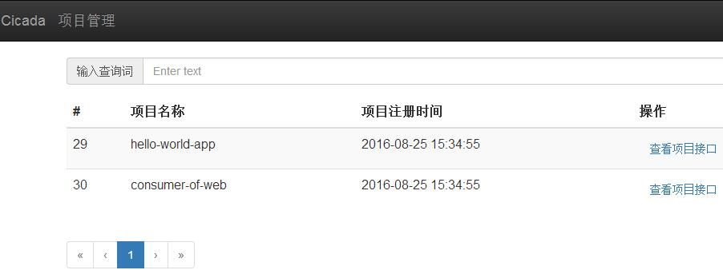
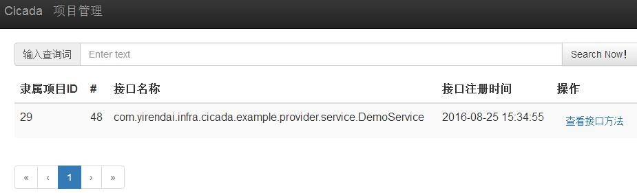
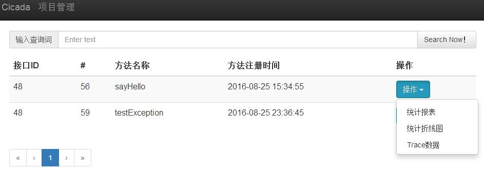
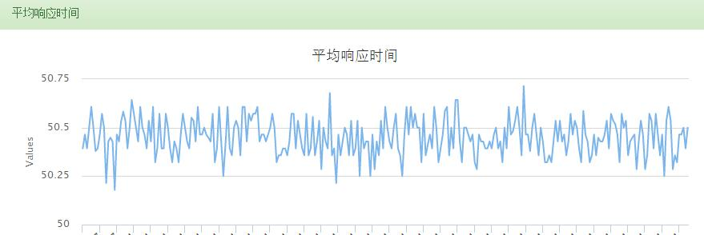
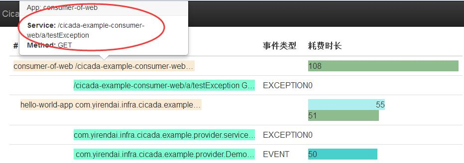

# 简介
宜人贷分布式跟踪系统，基于[Google Dapper论文](http://bigbully.github.io/Dapper-translation/)实现。

项目名称“蝉”，取自《名贤集·七言集》“金风未动蝉先觉”，代表我们开发这个系统的初衷和思路，我们希望这套系统能够厘清复杂的业务系统中的调用关系，实现调用路径分析和调用链跟踪，对于业务系统中的性能瓶颈以及异常信息能够做到“先知先觉”，帮助开发人员更快的排查问题。  

## Cicada运行效果
cicada的核心是调用链，通常来说，一个调用链是指一次业务请求涉及到的所有调用（包括方法调用、Http、SQL、IO...）。每次请求生成一个全局唯一的ID，通过这个ID将在分布在不同系统孤立的埋点数据串联起来，组合成调用链。

cicada的埋点坐标，为App、Service、Method。App代表当前埋点所在的业务系统名称，通常代表一个RPC服务；Service是埋点所在的接口名；Method为埋点的方法。

cicada的运行效果截图如下：  
+ App列表视图  

+ App下的Service列表视图  

+ service下的Method列表视图  

+ 统计折线图  
统计项目包括失败率、平均响应时间、最大相应时间、95line、999line等。下图显示平均相应时间的统计折线图。  

+ trace调用链视图  
针对每个事件，标注事件属于正常（EVENT）还是异常（EXCEPTION）。同时以柱状的形式展现每一个事件的耗时。
  
每行从左到右分别显示：当前调用链事件描述、事件类型、事件耗时（单位ms）。  
事件描述信息较长，一行无法显示，通过鼠标单击可以查看完整的提示信息（图中红色椭圆区域标识）。  

# 帮助文档  
1. [Cicada客户端使用](cicada-docs/cicada-client-quick-start.md)  
2. [Cicada客户端压测说明](cicada-docs/cicada-client-performance.md)  
3. [Cicada Demo使用说明](cicada-docs/cicada_demo_guide.md)  
4. [Cicada总体设计文档](cicada-docs/cicada_design.md)  
5. [Cicada统计模块设计文档](cicada-docs/cicada_statistic_design.md)  
6. [Cicada部署文档](cicada-docs/cicada_deployment.md)  
