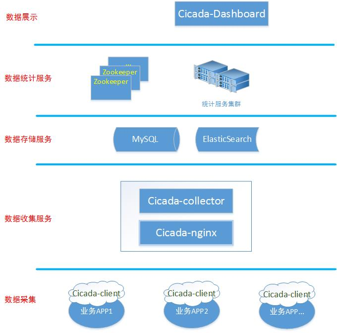
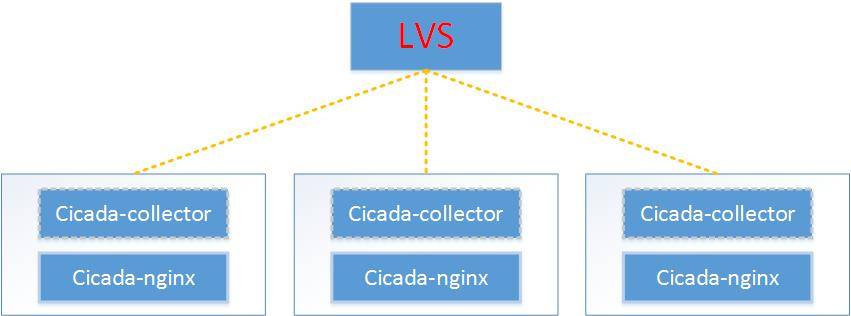
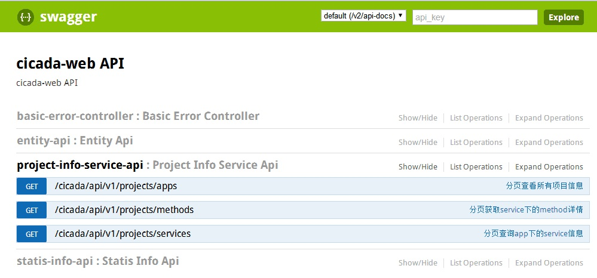

# Cicada部署
## 部署拓扑
cicada部署拓扑如下所示。  
  

具体部署步骤请参照下文。

## 部署步骤
### 引入客户端依赖
在项目中引入客户端的maven依赖。
```xml
<dependency>
</dependency>
```
目前cicada的RPC拦截是基于alibaba的dubbo（或者dangdang的dubboX）来实现。

### 数据存储服务部署
MySQL和Elastic集群部署，可自行google，不赘述。  
使用MySQL需要初始化数据库、表。比如我们建立一个```cicada```的数据库，使用 ```mysql -u user -p password cicada``` 连接之后，执行```scripts```目录下的```init.sql```即可。  
```sql
source scripts/init.sql
```

### 数据收集服务部署
#### cicada-nginx部署  
直接执行到项目根目录下的 ```cicada-nginx``` 目录，执行 ```deploy.sh``` 即可。
```
cd cicada-nginx && bash deploy.sh
```
安装之后，nginx默认会安装到 ```/opt/yrd_soft/tengine``` 目录，nginx的配置文件会放到 ```/etc/tengine``` 目录下，安装过程需要root权限。  

编辑```/etc/tengine/conf.d/cicada_collector_infra_9080.conf```，可以修改监听端口、消息的存储路径等配置信息。默认监听端口是 ```9080```，消息存储路径是```/opt/yrd_logs/tengine/cicada```。  
```
server {
    listen 9080;
    
    ... other config...

    location /upload {
        lua_need_request_body on;  
        content_by_lua 'local s = ngx.var.request_body';  
        if ($request_method != 'POST') {
            access_log "pipe:/usr/sbin/cronolog /opt/yrd_logs/tengine/access.log.%Y-%m-%d" main;
            return 405;
        }

        access_log "pipe:/usr/sbin/cronolog /opt/yrd_logs/tengine/cicada/record.log.%Y-%m-%d" cicada_record;
    }
}
```

执行nginx启动命令，指定配置文件即可。
```
/opt/yrd_soft/tengine/sbin/nginx -c /etc/tengine/nginx.conf
```

#### cicada-collector部署
cicada-collector**必须部署在每一台部署了cicada-nginx服务的机器上**。  
**编译** 
在cicada目录下，执行编译命令。  
```bash
bash build.sh local_build
```
编译之后，cicada-collector的部署包及配置文件会放在```./build/cicada-collector```目录下。

**修改配置并启动**
修改application.yml下的配置，提供```env_test```、```env_development```、```dev_production```三种环境的配置。在run.sh中，默认启用的是env_development配置。
```

trace:
  # nginx记录的trace日志存储目录，collector从此目录读取消息
  log.root.dir: /opt/yrd_logs/tengine/cicada/
  # 消息读取进度记录文件
  progress.file.path: /opt/yrd_data/cicada/progress.rcd

... others ...

spring:
  profiles: env_development
  datasource:
    platform: mysql
    url: jdbc:p6spy:mysql://127.0.0.1:3306/cicada?useUnicode=true&characterEncoding=UTF-8
    username: root
    password: 123456

elasticsearch:
  cluster.name: cicada_warehouse
  bulk.await.minutes: 10
  node:
    addr: 127.0.0.1
    port: 9300
  index:
    type.name: details
    span.prefix: cicada-span
    annotation.prefix: cicada-annotation

... others ...

```
修改对应环境的mysql、elasticsearch配置，执行```run.sh start```启动即可。

**数据收集服务高可用架构参考**
在生产环境，为保证日志收集服务的可靠性，可以参照如下架构来部署。  


### 数据统计服务部署 
**编译**  
在cicada目录下，执行编译命令。  
```bash
bash build.sh local_build
```
编译之后，```cicada-web```的部署包及配置文件会放在```./build/cicada-web```目录下。

**修改配置并运行**
+ 配置方式与```cicada-collector```差不多。  
+ 除了需要配置MySQL、ElasticSearch目录之外，cicada-web的运行还需要配置zookeeper的地址。  

修改配置之后，执行```run.sh```执行即可。

**api查看**
cicada-web服务默认监听端口是 9880。可以通过在浏览器中输入 ```http://host:9880/swagger-ui.html```查看cicada-web项目的接口列表，如下所示：  


### 数据展现
**项目下载**  
到[cicada-dashboard github地址]()，将项目checkout下来。

**编译**  
进入```cicada-dashboard```项目目录，修改src/config.js中的server配置。server地址是部署的cicada-web的地址。比如```http://127.0.0.1:9880```。  

修改之后，执行```npm run build```命令即可。编译输出会放到项目根目录的```publish```目录下。

**部署**  
因为编译之后的是静态文件，需要配置nginx或apache服务器。假设我们把publish目录下的index.html和bundle.js文件部署到```/opt/app/cicada-dashboard```目录下，则nginx配置如下：
```
    location / { 
        root /opt/app/cicada-dashboard/;
        index index.html;
    } 
```
重启nginx即可生效。

**解决CORS（跨域资源请求）问题**  
通过为```cicada-web```配置反向代理，解决CORS问题。  
假设我们的```cicada-web```服务部署在192.168.1.10上，可以在nginx中采用如下配置：  
```
    upstream cicada {
        server 10.106.2.59:9880;
    }

    # web部署
    location /cicada/api/v1 {
         # 允许CORS跨域请求
        if ($request_method = 'OPTIONS') {
            add_header 'Access-Control-Allow-Origin' '*';
            add_header 'Access-Control-Allow-Credentials' 'false';
            add_header 'Access-Control-Allow-Methods' 'HEAD, GET, POST, PUT, OPTIONS, DELETE'; 
            add_header 'Access-Control-Allow-Headers' 'X-Auth-Username, X-Auth-Password, User-Agent, X-Requested-With, Accept, Content-Type';
            add_header 'Access-Control-Max-Age' 3600;
            return 204;
        }   

        add_header 'Access-Control-Allow-Origin' '*';
        add_header 'Access-Control-Allow-Credentials' 'false';
        add_header 'Access-Control-Allow-Methods' 'HEAD, GET, POST, PUT, OPTIONS, DELETE'; 
        add_header 'Access-Control-Allow-Headers' 'X-Auth-Username, X-Auth-Password, User-Agent, X-Requested-With, Accept, Content-Type'; 

        #后端的Web服务器可以通过X-Forwarded-For获取用户真实IP
        proxy_set_header host $host;
        proxy_set_header X-Real-IP $remote_addr;
        proxy_set_header X-Forwarded-For $proxy_add_x_forwarded_for;

        # 代理服务器 upstream
        proxy_pass http://cicada;
        access_log  /opt/yrd_logs/tengine/cicada_web/access.log main;
    }
```  

同时，需要将```cicada-dashboard```中```src/config.js```的server配置修改为反向代理的地址，重新编译打包部署即可。

> nginx配置修改之后，需要执行reload操作。
