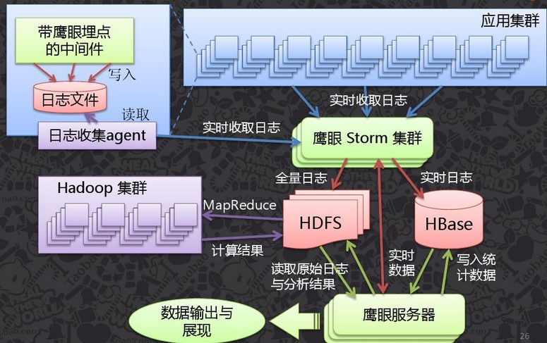
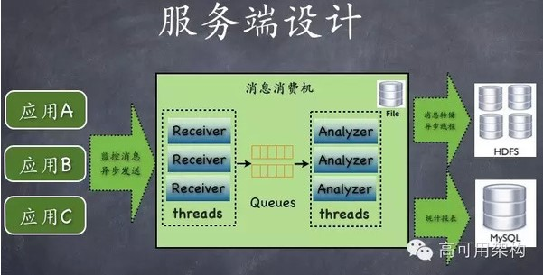
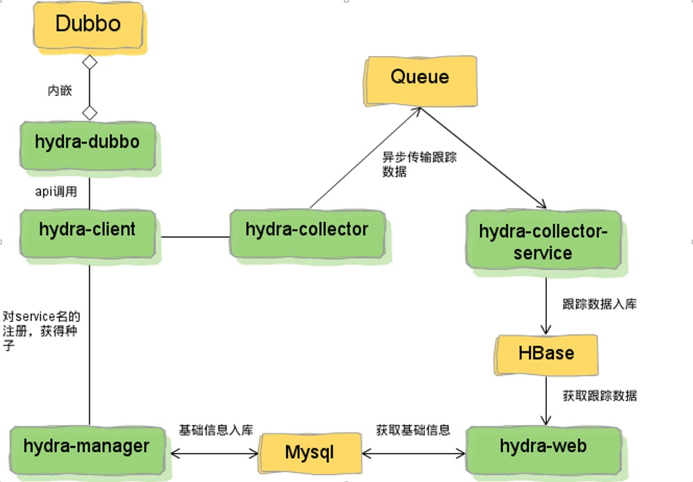
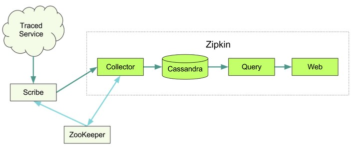
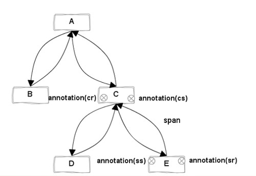
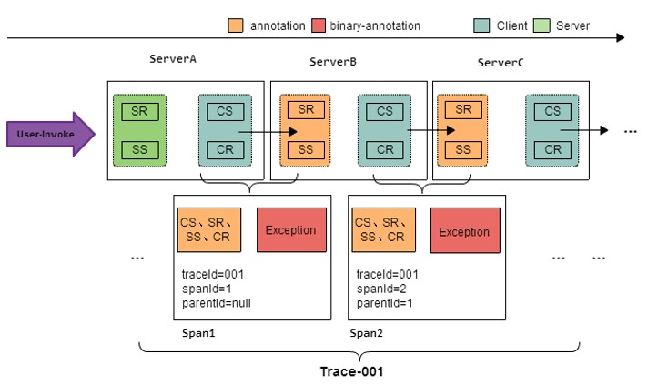
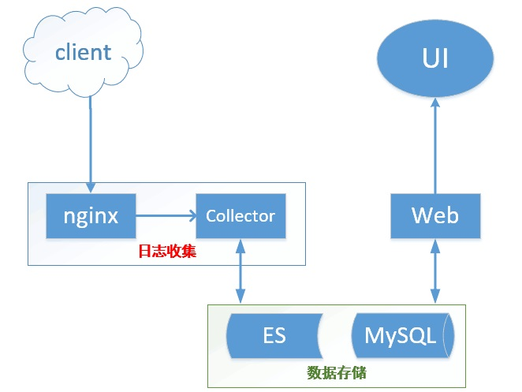

# 背景与目标
面对日趋复杂的分布式系统，如服务框架、消息中间件、缓存、数据层等，我司在业务性能瓶颈定位、故障排除等方面效率低下，生产环境中没有成熟的Trace工具，我们认为分布式跟踪系统适合且急需引入公司内部。

Trace系统需要能够透明的传递调用上下文，理解系统行为，理清后端调用关系，实现调用链跟踪，调用路径分析，帮助业务人员定位性能瓶颈，排查故障原因等；同时，需要对用户尽量透明，减少对业务代码的侵入性。 

我们的Trace系统为解决以上问题而设计。

## 理论依据
目前可查的分布式跟踪系统，设计思想都源于Google的论文《Dapper, a Large-Scale Distributed Systems Tracing Infrastructure》。

## 现有Trace系统调研
调研期间，我们同时参考了其他互联网企业分布式跟踪系统的原理以及应用场景，例如阿里的Eagle eye，Twitter的Zipkin，京东的hydra以及点评的CAT。

### Google Dapper && Alibaba Eagle eye
从实现来看，阿里的实现最接近Dapper论文中提到的方式。 Eagle eye架构如下图所示：  

#### 日志收集方式
+ 记录本地文件，使用额外的后台进程定期（时间间隔小）收集日志。这种方式的优势在于对应用的性能影响小，方便做消息堆积；但是需要在每台业务server上都部署并管理日志收集agent，运维量比较大。
+ Dapper的论文中提到自适应采样率以及自定义采样率两种方式，用以降低对业务性能的影响。

#### 用户接入方式：
+ 对于跨服务的调用链跟踪，Dapper可以无侵入的平滑接入；
+ 对于细粒度的植入点，Dapper的用户需要手动实现。因为google的一些服务是基于C++开发，C++没有对反射和动态代理等技术的原生支持，因此Dapper的客户端调用采用一致的方式应该是折衷。

#### 其他
Dapper与Eagle eye都不开源。

### 大众点评——CAT
架构简单。可以实现一个Trace系统的所有功能。架构如下图所示：  

#### 跟踪模型
+ Transaction是最重要的事件消息类型，适合记录跨越系统边界的程序访问行为,比如远程调用，数据库调用，也适合执行时间较长的业务逻辑监控，记录次数与时间开销。Transaction可嵌套。
+ 跨服务的跟踪功能与点评内部的RPC框架集成，这部分未开源。

#### 客户端接入方式
+ 对于方法调用、sql、url请求等粒度较小的兴趣点，需要业务人员手写代码实现。

#### 日志收集方式
+ 直接向日志收集器发异步请求（有本地内存缓存），一台客户端会连向几个服务端，当一个服务端出问题，数据不会丢失。  
> 当所有服务端都挂掉，消息会存入queue，当queue满了，就丢弃了，没有做数据存储本地等工作。
+ 全量采样，系统繁忙的时候对性能影响较大（可能达到10%的影响）

#### 其他
服务部署需要翻墙，最后一个稳定版本是2014年1月，之后已经失去维护。

### 京东——hydra
与dubbo框架集成。对于服务级别的跟踪统计，现有业务可以无缝接入。对于细粒度的兴趣点，需要业务人员手动添加。架构如下：  

#### Hydra中跟踪数据模型
+ Trace: 一次服务调用追踪链路。
+ Span: 追踪服务调基本结构，多span形成树形结构组合成一次Trace追踪记录。
+ Annotation: 在span中的标注点，记录整个span时间段内发生的事件。
+ BinaryAnnotation: 属于Annotation一种类型和普通Annotation区别，这键值对形式标注在span中发生的事件，和一些其他相关的信息。

#### 日志收集方式
与CAT类似。支持自适应采样，规则粗暴简单，对于每秒钟的请求次数进行统计，如果超过100，就按照10%的比率进行采样。

#### 其他
开源项目已于2013年6月停止维护。

### Twitter——OpenZipkin
功能、数据跟踪模型与hydra类似。Zipkin本身不开源，开源社区的是另外一套scala实现，依托于finagle这个RPC框架。架构如下：  

#### 其他 
Zipkin与其他Trace系统的不同之处在于：
+ Zipkin中针对 HttpClient、jax-rs2、jersey/jersey2等HTTP客户端封装了拦截器。可以在较小的代码侵入条件下实现URl请求的拦截、时间统计和日志记录等操作。
+ 日志收集。Cat是直接将日志发往消费集群；hydra是发给日志收集器，日志收集器推到消息队列；Zipkin的client将统计日志发往消息队列，日志收集器读取后落地存储；Dapper和Eagle eye是记录本地文件，后台进程定期扫描。

## Trace系统现状分析
目前调研的几种Trace系统实现，基本上都实现了以下功能：
+ 服务级别的调用可以平滑接入；
+ 在对代码有一定侵入性的前提下，开发人员可以自定义感兴趣的植入点。

然而，想要接入这些Trace系统存在诸多问题：
+ Google和alibaba的Trace系统不开源；
+ 京东和点评的虽然开源，但是已经多年没有维护，项目依赖的jdk版本以及第三方框架过于陈旧等等， 不适合用在生产环境中；
+ Twitter的OpenZipkin使用scala开发，而且其实现基于twitter内部的RPC框架finagle，第三方依赖比较多，接入和运维的成本非常高，不适合在我厂内部推广。

综上，我们决定借鉴这些开源实现的思想, 自行开发Trace系统。

# Trace模型
一次典型的分布式调用过程，如下图所示:  

Trace调用模型，主要有以下概念：
+ Trace  
> 一次完整的分布式调用跟踪链路。
+ Span  
> 追踪服务调基本结构，表示跨服务的一次调用；
> 多span形成树形结构，组合成一次Trace追踪记录。
+ Annotation  
> 在span中的标注点，记录整个span时间段内发生的事件。
+ BinaryAnnotation  
> 可以认为是特殊的Annotation，用户自定义事件。

+ Annotation类型
> **保留类型**  
> - Cs CLIENT_SEND，客户端发起请求   
> - Cr CLIENT_RECIEVE，客户端收到响应  
> - Sr SERVER_RECIEVE，服务端收到请求  
> - Ss SERVER_SEND，服务端发送结果  
> 
> **用户自定义类型**  
> - Event 记录普通事件  
> - Exception 记录异常事件  

+ Client && Server  
> 对于跨服务的一次调用，请求发起方为client，服务提供方为server  

各术语在一次分布式调用中，关系如下图所示：  
  

# 总体设计  
## 模块图  
  

## 模块说明  
### Client——数据采样模块  
**基本功能**  
+ 构建于公司的RPC框架之上，支持应用的透明接入。基于Dubbo实现跨服务的跟踪，针对Spring项目封装HttpFilter实现用户请求拦截。
+ 数据采样  
    - 基于中间件创建调用上下文，生成埋点  
    - 调用上下文放在ThreadLocal，应用透明  
    - 上下文数据跟随分布式调用传递  
+ 埋点数据  
    - TraceID，使用uuid，保证全局唯一  
    - 事件所在的应用、接口和方法名  
    - 事件类型  
    - 事件开始时间  
    - 事件耗时  
+ 消息发送至数据收集服务。  
+ 日志发送方案  
    - Http POST方式，批量异步上传数据  
    - 异步框架采用disruptor，减少对业务的影响  

**用户接入方式**
+ 透明接入  
> 对于接入公司RPC框架的项目，服务级别的统计，引入客户端jar包即可实现透明接入，自动拦截跨服务的调用，进行数据采样。  

+ 注解和API  
> 对于其他分散的服务，或者业务逻辑中其他小粒度的埋点，如服务内部的方法调用、数据库操作、URL请求等，提供**注解**以及api的方式。  

### 数据收集模块  
数据收集模块分两个子模块：日志接收子系统和日志存储子系统。  

**日志接收子系统**  
为简化开发和运维，日志接收子系统为nginx集群。nginx接收到客户端POST过来的消息数据，直接记录本地文件。  

**日志存储子系统**  
+ 从nginx日志中tail数据，记录读取进度  
+ 数据清洗  
+ 异步数据存储到Elastic Search  

采用这种方式的优点是开发和运维工作量小，方便水平扩展，可实现消息堆积。

### 数据存储模块
+ Span和Annotation数据存储在Elastic Search。
    - 通过traceId可以直接将span数据关联起来
    - 通过traceId和spanId可以定位所有的Annotation数据
+ 统计结果存储在mysql。

### WEB——统计和报表模块
+ 定期日志统计，统计项包括以下：
    - avgDuration：平均响应时间
    - minDuration：最快响应时间
    - maxDuration：最慢响应时间
    - line95Duration：95%line最大响应时间
    - line999Duration: 99.9%line最大响应时间
    - failureRate：请求失败率
+ 提供统计结果以及Trace数据访问的RESTful接口。

### UI——前端模块
用户交互界面。  
采用前后端分离的架构，通过ajax向统计端发送数据请求。为了提高页面渲染速度，使用React框架实现。

# References
1. [Dapper——大规模分布式系统的跟踪系统](http://bigbully.github.io/Dapper-translation/)
2. [淘宝——分布式调用跟踪系统介绍](http://wenku.baidu.com/link?url=UWecjDAATJImGC6D4D9Hl1zd8eOuqE-5cpOPqVtBYN8fYWHPQqUcGJTAITb_Z0WsteAIWvv4oXyA2mVC513aF6k3exY6Vqyetu9MZiT0a03)
3. [Zipkin官方文档](http://zipkin.io/)
4. [点评CAT github地址](https://github.com/dianping/cat)
5. [京东hydra github地址](https://github.com/odenny/hydra)

