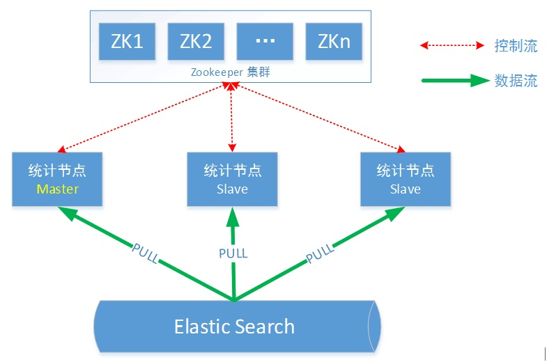
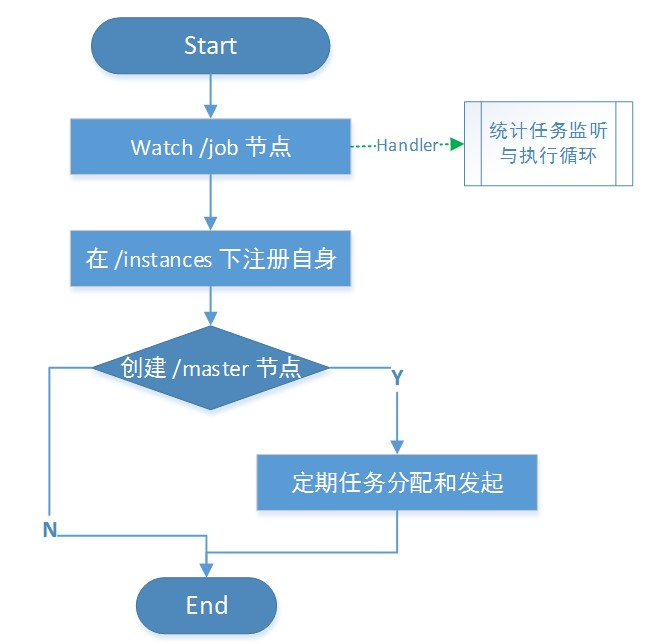
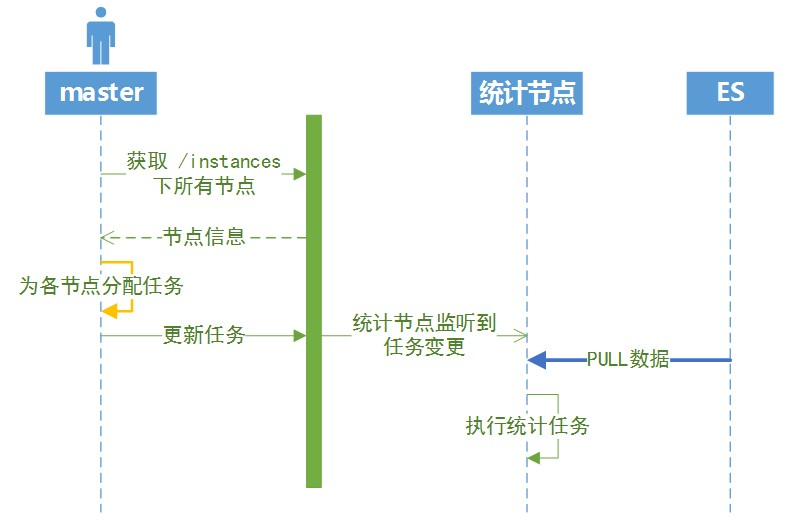

[TOC]
# 背景和目标
cicada的统计任务，是针对整个公司的服务在一段时间内产生的所有业务调用进行统计。如果统计任务分配到单节点，一方面数据量巨大，单机的内存和计算资源可能难以承受；另一方面会存在单点问题。
因此需要设计一个合理的分布式计算框架。主要从以下两个方面进行考虑：
+ 实现对等节点的集群管理，保证统计系统的伸缩性与可靠性。
+ 合理地对统计任务进行分片，保证将统计的数据和计算量均匀地分配到各计算节点上。

## 集群管理方案
调研了多种集群管理的开源方案，按照管理逻辑是否嵌入到JVM进程，分为分离式集群管理、内嵌式集群管理方案两种。

### 分离式集群管理——zookeeper
集群管理与业务代码分开部署。同类产品consul，doozerd，etcd。  

**优点** 
+ 管理层与业务逻辑分离，层次清晰；
+ 业务节点之间不需要通信，减少耦合

**缺点**  
+ 依赖外部服务；
+ 运维复杂度以及硬件成本稍微高一些

### 内嵌式集群管理——hazelcast
将集群管理的代码、功能内嵌到JVM进程之中。同类产品：Coherence, Terracotta

**优点**  
+ 用户不需要额外配置类似zk的集群管理框架，接入简单；
+ 集群管理对用户透明；
+ 降低运维和硬件成本。

**缺点**
+ 现有的开源产品，倾向于作为分布式缓存来使用，提供的功能大而全，集群管理作为附带功能
+ 缺少成熟的应用案例
+ 基于广播的动态节点增删，节点之前消息同步较频繁，可能引发广播风暴。

【结论】
如果自行开发分布式框架，需要解决节点通信、状态同步、选主、处理failover等各种问题，开发复杂度较高，周期过长，暂不考虑。  
我们认为外置的集群管理，其硬件以及运维成本在可控的范围之内，而内嵌式的集群管理存在诸多问题，各种开源组件缺乏成熟的案例作支撑。最终选择使用zookeeper实现集群管理的功能。  

# 整体设计
## 分布式统计架构
如下图所示。  


## 模块说明
### Zookeeper
引入zookeeper，负责集群配置管理、自动选Master、任务同步等；支持统计节点动态伸缩。

### 统计节点之Master
+ Master节点是具有任务分配功能的统计节点。
+ 没有固定的master，主挂之后自动选举新的master。

主要负责以下功能逻辑：
+ 作为统计节点，参与数据统计任务的执行。
+ 任务分片及节点任务分配 
    - 根据当前alive的节点列表，分配各节点任务分片；
    - 更新zookeeper上的节点任务信息。

### 统计节点之Slave
+ 监听zookeeper上的任务节点，watch到变更之后，找到自身对应的任务分片，从ES中获取数据执行统计任务。

# 详细设计
## 任务分片
统计任务的过程，就是从Elastic Search中取出对应时间段的Span数据（每个Span对应一次跨服务的调用），根据Span的App（应用名称）、Service（接口名称）、Method（方法）分组之后，再进行排序、统计之类的操作。  

**分片逻辑**  
+ 针对Span数据的APP、Service、Method信息进行hash，然后对分片的Slot（分片总数，默认是1024）取模，得出的结果就是每条数据的sliceNo。  
+ 每个计算节点负责 0~slot 区域的一个子区间，比如机器1负责0~255，机器2负责256~511 ……。  
+ 每台计算节点从elasticsearch取数据的时候，只取sliceNo在自己负责的区间范围的数据进行统计。 
+ 所有来自相同App、Service、Method的Span数据，在统计的时候都会落到同一个计算节点上，所以统计结果不需要进行合并，直接落库存储即可。而且以Method区分数据维度的方式，粒度比较细，可以保证各计算节点的数据量和计算量相对均匀。  

## Zookeeper node设计
### /infra/cicada/web/master 
+ Node类型  
临时节点  
+ Node内容  
master节点信息  
+ 说明  
统计系统启动时设置此节点，所有节点监听此节点变化。若此节点消失，触发自动选主。 

### /infra/cicada/web/instances 
+ Node类型  
永久性node  
+ Node内容  
所有统计节点列表，每个统计节点是一个临时node。node列表示例如下所示：
    ```
    /infra/cicada/web/instance  
                        |---- /node-1  
                        `---- /node-2  
    ```
+ 说明  
Master发起统计任务时，需要首先获取此临时node的内容，然后为分配各个计算节点的hash分片。  

### /infra/cicada/web/job 
+ Node类型
永久性node
+ Node内容
所有节点的统计任务，包括分片信息，统计的数据时间段等
+ 备注
由master设置此node的值，所有节点监听此node。Node内容变更之后触发各统计节点根据node内容执行各自的任务分片。

## 程序启动逻辑  


## 选主逻辑
+ 第一个注册的节点成为master节点
+ 所有注册节点监听/master节点变更，若/master失效，触发自动选注逻辑。所有节点发起create /master节点的任务，创建成功的成为master节点。

## 节点动态变更
+ 新增节点自动到/instances下注册自身，临时节点。
+ 节点失效，临时节点会消失。

## 统计任务流程
如下图。  

### 流程说明
Master节点定期发起统计任务，步骤上图所示：
+ Master到zookeeper获取节点列表；
+ 根据节点信息，为各节点分配任务；
+ Master到zookeeper上更新任务；
+ 各统计节点（master && slave）监听到zookeeper任务信息变更，获取任务信息；
+ 统计节点根据各自的任务分片，到elastic search上拉取对应的分片数据；
+ 各节点执行统计任务，统计结果入mysql。
